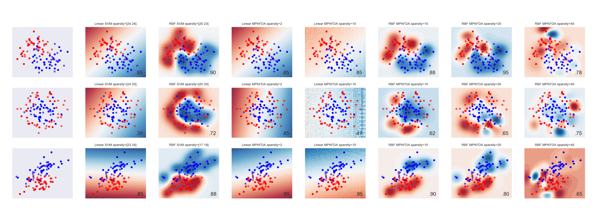

# sklearn-Infer.NET-wrapper
Wrapper for the Infer.NET learners (Bayes Point Machine etc)

Note that whilst this code is released under the MIT license, Infer.NET has [it's own license](bin/InferNetLicense.md). For this reason the binaries are not distributed here. Run the script [get_infernet.sh](get_infernet.sh) to pull version 2.6.

Example image (the last 4 columns are the Bayes Point Machine):

